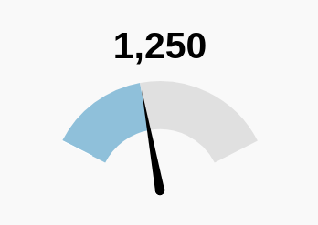

# gauge-coffee-react

A react wrapper for [gauge.coffee](https://bernii.github.io/gauge.js/)

|Name             |Description                |Type     |
|:---------------:|:-------------------------:|:-------:|
|`value`          |The value of the gauge     |`number` |
|`maxValue`       |Max value of the gauge     |`number` |
|`minValue`       |Min value of the gauge     |`number` |
|`animationSpeed` |The speed of the animation |`number` |
